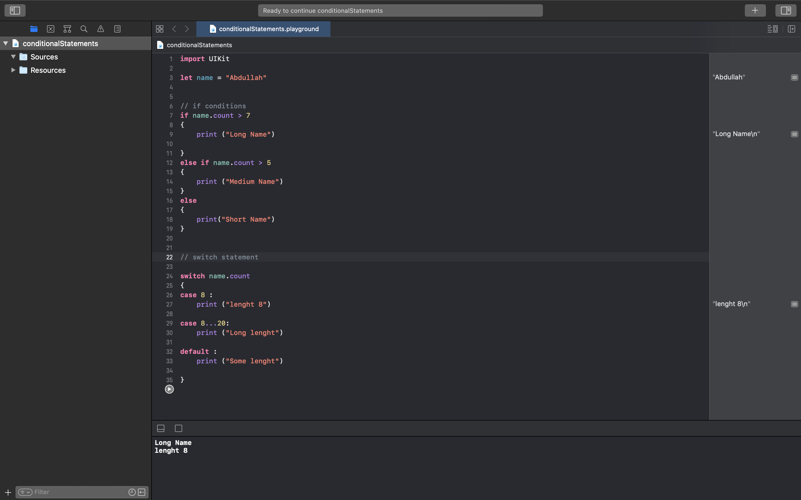

# Conditional statements in Swift 

## Swift program

import UIKit

let name = "Abdullah"

// if conditions
if name.count > 7
{
    print ("Long Name")

}
else if name.count > 5
{
    print ("Medium Name")
}
else
{
    print("Short Name")
}

// switch statement

switch name.count
{
case 8 :
    print ("lenght 8")
    
case 8...20:
    print ("Long lenght")
    
default :
    print ("Some lenght")

}

## Playground Preview

Feel free to Star or Fork it and make your changes , then make pull request.

We will appreciate your Changes and Review it 😄

	 
	 
	 
	 
	
	
Loading

	 
	 
	 
	 

